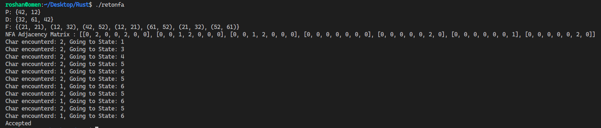

# RegEx-GlushkovNFA
# RegEx-GlushkovNFA
Uses Glushkov Construction Algorithm to generate Glushkov NFA from a given Regular Expression.

For each alphabet in the regular expression a state is generated and is represented by **{StateNumber}{alphabet}**.
The screenshot of executed program is shown below the RegEx taken here is $21^{\star}2 \\: + \\: 1(21)^{\star}$

 
